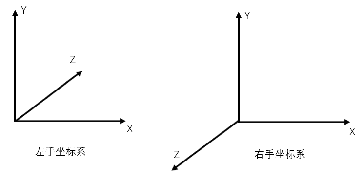

这章深入了解3d位置和转换的细节。

首先考虑坐标系，在计算机图形学中，3D空间最常用于笛卡尔坐标系。该坐标系分为两种：左手坐标系和右手坐标系。详情见图。  
  
现在我们已经讨论过坐标系，考虑3D空间。 点在不同的空间中具有不同的坐标。 作为一维中的一个例子，假设我们有一个标尺，我们在标尺的5英寸标记处注意到点P。 现在，如果我们将标尺向右移动1英寸，则相同的点位于4英寸标记处。 通过移动标尺，参考框架已经改变。 因此，当点没有移动时，它有一个新的坐标。

在3D中，空间通常由原点和来自原点的三个唯一轴定义：X，Y和Z.计算机图形中通常使用多个空间：对象空间，世界空间，视图空间，投影空间和屏幕空间。

对象空间：

请注意，多维数据集以原点为中心。 对象空间，也称为模型空间，是指艺术家在创建3D模型时使用的空间。 通常，艺术家创建以原点为中心的模型，以便更容易执行转换，例如旋转模型，我们将在讨论转换时看到。 八个顶点具有以下坐标：

    (-1,  1, -1)
    ( 1,  1, -1)
    (-1, -1, -1)
    ( 1, -1, -1)
    (-1,  1,  1)
    ( 1,  1,  1)
    (-1, -1,  1)
    ( 1, -1,  1)
因为对象空间是艺术家在设计和创建模型时通常使用的对象空间，所以存储在磁盘上的模型也在对象空间中。 应用程序可以创建顶点缓冲区来表示此类模型，并使用模型数据初始化缓冲区。 因此，顶点缓冲区中的顶点通常也位于对象空间中。 这也意味着顶点着色器接收对象空间中的输入顶点数据。

世界空间：

世界空间是场景中每个对象共享的空间。 它用于定义我们希望渲染的对象之间的空间关系。 为了想象世界空间，我们可以想象我们正站在朝北的长方形房间的西南角。 我们将我们的脚站立的角落定义为原点，（0,0,0）。 X轴向我们的右边; Y轴上升; 并且Z轴向前，与我们面对的方向相同。 当我们这样做时，房间中的每个位置都可以用一组XYZ坐标来识别。 例如，可能有一把椅子在前方5英尺处，在我们右侧2英尺处。 在椅子顶部的8英尺高的天花板上可能有一盏灯。 然后我们可以将椅子的位置称为（2,0,5），将灯的位置称为（2,8,5）。 世界空间就是描述我们所看到的，因为它们告诉我们世界上物体彼此之间的关系。可以理解你有一个地图。

视图空间:

视图空间（有时称为相机空间）类似于世界空间，因为它通常用于整个场景。 但是，在视图空间中，原点位于查看器或摄像机。 视图方向（观察者正在看的位置）定义正Z轴。 应用程序定义的“向上”方向变为正Y轴，如下所示。

左边为世界视角，右边为视图视角。因为你的屏幕无法展现整个世界空间，所以有了这个东西。

投影空间：

投影空间是指从视图空间应用投影变换后的空间。你可以理解为视图是3维的但是投影到屏幕上是二维的所以需要这个转换， 在此空间中，可见内容的X和Y坐标范围为-1到1，Z坐标范围为0到1。

屏幕空间：

屏幕空间通常用于指代帧缓冲区中的位置。 因为帧缓冲区通常是2D纹理，所以屏幕空间是2D空间。 左上角是坐标为（0,0）的原点。 正X向右，正Y向下。 对于w像素宽且h像素高的缓冲区，最右下像素具有坐标（w-1，h-1）。

空间到空间的转换：

转换最常用于将顶点从一个空间转换为另一个空间。 在3D计算机图形学中，管道中逻辑上有三种这样的变换：世界，视图和投影变换。 下一个教程将介绍单个转换操作，如转换，旋转和缩放。

世界变换：

顾名思义，世界变换将顶点从对象空间转换为世界空间。 它通常由一个或多个缩放，旋转和平移组成，基于我们想要给对象的大小，方向和位置。 场景中的每个对象都有自己的世界变换矩阵。 这是因为每个对象都有自己的大小，方向和位置。可以直接理解为做了这个变换就相当于把这个对象放进了世界。

视图变换：

顶点转换为世界空间后，视图转换将这些顶点从世界空间转换为视图空间。回想一下之前的讨论，观看空间是世界从观众（或相机）的角度出现的。在视图空间中，观察者位于沿正Z轴向外看的原点。

值得注意的是，尽管视图空间是来自观察者参照系的世界，但视图变换矩阵应用于顶点，而不是观察者。因此，视图矩阵必须执行我们应用于我们的查看器或相机的相反转换。例如，如果我们想要将摄像机朝向-Z方向移动5个单元，我们需要计算一个视图矩阵，它可以沿着+ Z方向将顶点平移5个单位。虽然相机向后移动，但从相机的角度来看，顶点已向前移动。在XNA Math中，一个方便的API调用XMMatrixLookAtLH（）通常用于计算视图矩阵。我们只需要告诉它观察者在哪里，在哪里看，以及表示观察者顶部的方向，也称为向上矢量，以获得相应的视图矩阵。

投影变换：

投影变换将顶点从诸如世界和视图空间的3D空间转换为投影空间。 在投影空间中，顶点的X和Y坐标是从3D空间中该顶点的X / Z和Y / Z比获得的。

在3D空间中，事物以透视的方式出现。也就是说，物体越近，它出现的越大。如图所示，在远离观察者眼睛的d个单位处高h单位的树的尖端将出现在与另一棵树的尖端2h单位高和2d单位远的相同点处。因此，在2D屏幕上出现顶点的位置与其X / Z和Y / Z比率直接相关。

定义3D空间的参数之一称为视场（FOV）。 FOV表示在特定方向上查看哪些对象从特定位置可见。人类有一个前瞻性的FOV（我们无法看到我们背后的东西），我们看不到太近或太远的物体。在计算机图形学中，FOV包含在视锥体中。视锥体由3D中的6个平面定义。这些平面中的两个平行于XY平面。这些被称为近Z和远Z平面。其他四个平面由观察者的水平和垂直视野定义。视场越宽，视锥体体积越宽，观察者看到的物体越多。

GPU会过滤掉视锥体外的对象，这样就不必花时间渲染无法显示的内容。此过程称为裁剪。视锥体是一个四面金字塔，顶部被切掉。剪切此卷是很复杂的，因为要剪切一个视锥体平面，GPU必须将每个顶点与平面的等式进行比较。相反，GPU通常首先执行投影变换，然后针对视锥体量进行剪辑。投影变换对视锥体的影响是金字塔形视锥体成为投影空间中的盒子。这是因为，如前所述，在投影空间中，X和Y坐标基于3D空间中的X / Z和Y / Z.因此，点a和点b在投影空间中将具有相同的X和Y坐标，这就是视锥体成为盒子的原因。

假设两棵树的尖端恰好位于顶视图平截头体边缘。进一步假设d = 2h。沿投影空间中顶边的Y坐标将为0.5（因为h / d = 0.5）。因此，任何大于0.5的Y投影后Y值都将被裁剪。这里的问题是0.5由程序选择的垂直视场确定，并且不同的FOV值导致GPU必须剪切的不同值。为了使过程更方便，3D程序通常缩放顶点的投影X和Y值，以便可见的X和Y值的范围从-1到1.换句话说，任何X或Y坐标都在[-1]之外1]范围将被删除。为了使该剪切方案起作用，投影矩阵必须通过h / d或d / h的倒数来缩放投影顶点的X和Y坐标。 d / h也是FOV一半的余切。通过缩放，视锥体的顶部变为h / d * d / h = 1.大于1的任何内容都将被GPU裁剪。这就是我们想要的。

通常也对投影空间中的Z坐标进行类似的调整。我们希望近和远Z平面分别在投影空间中为0和1。当Z = 3D空间中的近Z值时，Z在投影空间中应为0;当Z = 3D空间中的远Z时，Z在投影空间中应为1。完成此操作后，GPU [0 1]以外的任何Z值都将被裁剪掉。

在Direct3D 11中，获取投影矩阵的最简单方法是调用XMMatrixPerspectiveFovLH（）方法。我们只提供4个参数-FOVy，Aspect，Zn和Zf-并返回一个矩阵，它可以完成上面提到的所有必要操作。 FOVy是Y方向的视野。 Aspect是宽高比，即视图宽度与高度的比率。从FOVy和Aspect，可以计算FOVx。该纵横比通常从渲染目标宽度与高度的比率获得。 Zn和Zf分别是视图空间中的近和远Z值。

 

 

使用转换

在上一个教程中，我们编写了一个程序，用于渲染单个三角形。 当我们创建顶点缓冲区时，我们使用的顶点位置直接在投影空间中，这样我们就不必执行任何变换。 现在我们已经了解了3D空间和变换，我们将修改程序，以便在对象空间中定义顶点缓冲区，就像它应该的那样。 然后，我们将修改顶点着色器以将顶点从对象空间转换为投影空间。

修改顶点缓冲区

由于我们开始以三维方式表示事物，因此我们将前一个教程中的平面三角形更改为多维数据集。 这将使我们能够更清楚地展示这些概念。

SimpleVertex vertices[] =
    {
        { XMFLOAT3( -1.0f,  1.0f, -1.0f ), XMFLOAT4( 0.0f, 0.0f, 1.0f, 1.0f ) },
        { XMFLOAT3(  1.0f,  1.0f, -1.0f ), XMFLOAT4( 0.0f, 1.0f, 0.0f, 1.0f ) },
        { XMFLOAT3(  1.0f,  1.0f,  1.0f ), XMFLOAT4( 0.0f, 1.0f, 1.0f, 1.0f ) },
        { XMFLOAT3( -1.0f,  1.0f,  1.0f ), XMFLOAT4( 1.0f, 0.0f, 0.0f, 1.0f ) },
        { XMFLOAT3( -1.0f, -1.0f, -1.0f ), XMFLOAT4( 1.0f, 0.0f, 1.0f, 1.0f ) },
        { XMFLOAT3(  1.0f, -1.0f, -1.0f ), XMFLOAT4( 1.0f, 1.0f, 0.0f, 1.0f ) },
        { XMFLOAT3(  1.0f, -1.0f,  1.0f ), XMFLOAT4( 1.0f, 1.0f, 1.0f, 1.0f ) },
        { XMFLOAT3( -1.0f, -1.0f,  1.0f ), XMFLOAT4( 0.0f, 0.0f, 0.0f, 1.0f ) },
    };
如果您注意到，我们所做的只是指定立方体上的八个点，但我们实际上没有描述各个三角形。 如果我们按原样传递，输出将不是我们所期望的。 我们需要通过这八个点指定形成立方体的三角形。

在立方体上，许多三角形将共享相同的顶点，并且一遍又一遍地重新定义相同的点将浪费空间。 因此，有一种方法只指定八个点，然后让Direct3D知道要为三角形选择哪些点。 这是通过索引缓冲区完成的。 索引缓冲区将包含一个列表，该列表将引用缓冲区中的顶点索引，以指定在每个三角形中使用哪些点。 下面的代码显示了构成每个三角形的点。

    WORD indices[] =
    {
        3,1,0,
        2,1,3,
 
        0,5,4,
        1,5,0,
 
        3,4,7,
        0,4,3,
 
        1,6,5,
        2,6,1,
 
        2,7,6,
        3,7,2,
 
        6,4,5,
        7,4,6,
    };
如您所见，第一个三角形由点3,1和0定义。这意味着第一个三角形的顶点位于：（ -  1.0f，1.0f，1.0f），（1.0f，1.0f，-1.0） f），和（-1.0f，1.0f，-1.0f）。 立方体上有六个面，每个面由两个三角形组成。 因此，您会看到此处定义的12个三角形。

由于每个顶点都是明确列出的，并且没有两个三角形共享边（至少，就像它已经定义的那样），这被认为是一个三角形列表。 总的来说，对于三角形列表中的12个三角形，我们将需要总共36个顶点。

索引缓冲区的创建与顶点缓冲区非常相似，我们在结构中指定了诸如大小和类型之类的参数，并称为CreateBuffer。 类型是D3D11_BIND_INDEX_BUFFER，因为我们使用DWORD声明了我们的数组，所以我们将使用sizeof（DWORD）。

    D3D11_BUFFER_DESC bd;
    ZeroMemory( &bd, sizeof(bd) );
    bd.Usage = D3D11_USAGE_DEFAULT;
    bd.ByteWidth = sizeof( WORD ) * 36;        // 36 vertices needed for 12 triangles in a triangle list
    bd.BindFlags = D3D11_BIND_INDEX_BUFFER;
    bd.CPUAccessFlags = 0;
    bd.MiscFlags = 0;
    InitData.pSysMem = indices;
    if( FAILED( g_pd3dDevice->CreateBuffer( &bd, &InitData, &g_pIndexBuffer ) ) )
        return FALSE;
一旦我们创建了这个缓冲区，我们就需要设置它，以便Direct3D知道在生成三角形时引用这个索引缓冲区。 我们指定缓冲区的指针，格式和缓冲区中的偏移量以开始引用。

    // Set index buffer
    g_pImmediateContext->IASetIndexBuffer( g_pIndexBuffer, DXGI_FORMAT_R16_UINT, 0 );
修改顶点着色器

在上一个教程的顶点着色器中，我们采用输入顶点位置并输出相同的位置而不进行任何修改。我们可以这样做，因为输入顶点位置已经在投影空间中定义。现在，因为输入顶点位置是在对象空间中定义的，所以我们必须在从顶点着色器输出之前对其进行变换。我们通过三个步骤完成此任务：从对象转换到世界空间，从世界转换到视图空间，以及从视图转换到投影空间。我们需要做的第一件事是声明三个常量缓冲区变量。常量缓冲区用于存储应用程序需要传递给着色器的数据。在渲染之前，应用程序通常会将重要数据写入常量缓冲区，然后在渲染过程中可以读取数据。在FX文件中，常量缓冲区变量在C ++结构中声明为全局变量。我们将使用的三个是HLSL类型“矩阵”的世界，视图和投影变换矩阵。

一旦我们声明了我们需要的矩阵，我们就会更新顶点着色器以使用矩阵变换输入位置。通过将矢量乘以矩阵来变换矢量。在HLSL中，这是使用mul（）内部函数完成的。我们的变量声明和新的顶点着色器如下所示：

    cbuffer ConstantBuffer : register( b0 )
    {
        matrix World;
        matrix View;
        matrix Projection;
    }
    
    //
    // Vertex Shader
    //
    VS_OUTPUT VS( float4 Pos : POSITION, float4 Color : COLOR )
    {
        VS_OUTPUT output = (VS_OUTPUT)0;
        output.Pos = mul( Pos, World );
        output.Pos = mul( output.Pos, View );
        output.Pos = mul( output.Pos, Projection );
        output.Color = Color;
        return output;
    }
在顶点着色器中，每个mul（）将一个变换应用于输入位置。 世界，视图和投影变换按顺序依次应用。 这是必要的，因为向量和矩阵乘法不是可交换的。

设置矩阵

我们更新了顶点着色器以使用矩阵进行变换，但我们还需要在程序中定义三个矩阵。 这三个矩阵将存储渲染时要使用的变换。 在渲染之前，我们将这些矩阵的值复制到着色器常量缓冲区。 然后，当我们通过调用Draw（）启动渲染时，我们的顶点着色器读取存储在常量缓冲区中的矩阵。 除了矩阵之外，我们还需要一个代表常量缓冲区的ID3D11Buffer对象。 因此，我们的全局变量将添加以下内容：

    ID3D11Buffer* g_pConstantBuffer = NULL;
    XMMATRIX g_World;
    XMMATRIX g_View;
    XMMATRIX g_Projection;
要创建ID3D11Buffer对象，我们使用ID3D11Device :: CreateBuffer（）并指定D3D11_BIND_CONSTANT_BUFFER。

    D3D11_BUFFER_DESC bd;
    ZeroMemory( &bd, sizeof(bd) );
    bd.Usage = D3D11_USAGE_DEFAULT;
    bd.ByteWidth = sizeof(ConstantBuffer);
    bd.BindFlags = D3D11_BIND_CONSTANT_BUFFER;
    bd.CPUAccessFlags = 0;
    if( FAILED(g_pd3dDevice->CreateBuffer( &bd, NULL, &g_pConstantBuffer ) ) )
        return hr;
我们需要做的下一件事是提出三个矩阵，我们将用它来进行转换。我们希望三角形位于原点上，与XY平面平行。这正是它如何存储在对象空间中的顶点缓冲区中。因此，世界变换不需要做任何事情，我们将世界矩阵初始化为单位矩阵。我们想要设置我们的相机，使其位于[0 1 -5]，查看点[0 1 0]。我们可以使用向上矢量[0 1 0]调用XMMatrixLookAtLH（）来方便地为我们计算视图矩阵，因为我们希望+ Y方向始终保持在顶部。最后，为了得到投影矩阵，我们称之为XMMatrixPerspectiveFovLH（），具有90度垂直视场（pi / 2），宽高比为640/480，来自我们的后缓冲区大小，以及近和远Z分别为0.1和110。这意味着屏幕上将看不到小于0.1或超过110的任何内容。这三个矩阵存储在全局变量g_World，g_View和g_Projection中。

更新常量缓冲区

我们有矩阵，现在我们必须在渲染时将它们写入常量缓冲区，以便GPU可以读取它们。 要更新缓冲区，我们可以使用ID3D11DeviceContext :: UpdateSubresource（）API并将指针传递给以与着色器常量缓冲区相同的顺序存储的矩阵。 为了做到这一点，我们将创建一个与着色器中的常量缓冲区具有相同布局的结构。 另外，由于矩阵在C ++和HLSL中的内存排列方式不同，我们必须在更新之前转置矩阵。

    //
    // Update variables
    //
    ConstantBuffer cb;
    cb.mWorld = XMMatrixTranspose( g_World );
    cb.mView = XMMatrixTranspose( g_View );
    cb.mProjection = XMMatrixTranspose( g_Projection );
    g_pImmediateContext->UpdateSubresource( g_pConstantBuffer, 0, NULL, &cb, 0, 0 );
 
